# 🏠 House Price Prediction Using Machine Learning

<div align="center">


### 🚀 A Machine Learning Project for Predicting House Prices and Comparing Multiple Regression Models

</div>

---

## 📌 Project Overview

This project focuses on **House Price Prediction using Machine Learning**.

The main objective is to build, train, evaluate, and compare multiple regression models to predict the **`houseprice`** of a property based on available features.

The project covers the complete machine learning workflow:

> 📂 Data Loading → 🧹 Data Preparation → ✂️ Train-Test Split → ⚙️ Feature Scaling → 🤖 Model Training → 🔄 Cross Validation → 🎯 Hyperparameter Tuning → 📊 Model Comparison → 🏆 Best Model Selection

---

# 🎬 Project Preview

<div align="center">

<!-- Add your project GIF here -->


<br>

### 📊 Machine Learning Model Workflow


</div>

> 💡 **Note:** Create an `images` folder and add your GIF files with the names `project_demo.gif` and `model_workflow.gif`.

---

# 📦 What Is Used In This Project?

<div align="center">

| 🛠️ Technology          | 📌 Purpose                    |
| ----------------------- | ----------------------------- |
| 🐍 **Python**           | Main Programming Language     |
| 🐼 **Pandas**           | Data Loading and Manipulation |
| 🔢 **NumPy**            | Numerical Operations          |
| 🤖 **Scikit-learn**     | Machine Learning Models       |
| 📊 **Matplotlib**       | Data Visualization            |
| ⚙️ **StandardScaler**   | Feature Scaling               |
| 🔄 **Cross Validation** | Model Validation              |
| 🎯 **GridSearch / CV**  | Hyperparameter Optimization   |

</div>

---

# 🧰 Libraries Used

```python
import pandas as pd
import numpy as np

from sklearn.model_selection import (
    train_test_split,
    GridSearchCV,
    KFold,
    StratifiedKFold,
    LeaveOneOut,
    TimeSeriesSplit,
    cross_val_score
)

from sklearn.preprocessing import StandardScaler

from sklearn.linear_model import (
    LinearRegression,
    Ridge,
    Lasso,
    RidgeCV,
    LassoCV
)

from sklearn.tree import DecisionTreeRegressor

from sklearn.ensemble import RandomForestRegressor

from sklearn.svm import SVR

from sklearn.metrics import (
    mean_squared_error,
    mean_absolute_error,
    r2_score
)

from sklearn.pipeline import make_pipeline

import matplotlib.pyplot as plt
```

---

# 🎯 Project Objective

The main objectives of this project are:

<div align="center">

| #   | Objective                                      |
| --- | ---------------------------------------------- |
| 1️⃣ | Load and understand the House Price dataset    |
| 2️⃣ | Separate feature variables and target variable |
| 3️⃣ | Perform Train-Test Split                       |
| 4️⃣ | Apply Feature Scaling                          |
| 5️⃣ | Build Ridge Regression Model                   |
| 6️⃣ | Build Lasso Regression Model                   |
| 7️⃣ | Perform Multiple Cross Validation Techniques   |
| 8️⃣ | Build Decision Tree Regression Model           |
| 9️⃣ | Build Random Forest Regression Model           |
| 🔟  | Compare Different SVR Kernels                  |
| 🏆  | Compare all models and select the Best Model   |

</div>

---

# 📂 Dataset Information

The project uses:

```text
house_price.csv
```

### 🎯 Target Variable

```text
houseprice
```

### 📅 Column Removed Before Model Training

```text
sale_date
```

The project also removes extra spaces from column names:

```python
data.columns = data.columns.str.strip()
```

---

# 🔄 Complete Machine Learning Workflow

```mermaid
flowchart LR
    A[📂 Load Dataset] --> B[🧹 Clean Column Names]
    B --> C[🎯 Select X and y]
    C --> D[✂️ Train Test Split]
    D --> E[⚙️ StandardScaler]
    E --> F[🤖 Train Models]
    F --> G[🔄 Cross Validation]
    G --> H[🎯 Hyperparameter Tuning]
    H --> I[📊 Evaluate Models]
    I --> J[🏆 Select Best Model]
```



---

# 🏗️ Project Parts

## 🟦 PART A — Data Loading

The dataset is loaded using Pandas.

```python
data = pd.read_csv("house_price.csv")

print(data.head())
print(data.info())
```

### ✔️ Tasks Performed

* Load dataset
* Display first rows
* Check dataset information
* Understand columns and data types

---

## 🟩 PART B — Data Preparation

### 1️⃣ Feature and Target Separation

```python
X = data.drop("houseprice", axis=1)

y = data["houseprice"]
```

### 2️⃣ Remove Target and Date Column

```python
X = data.drop(
    ["houseprice", "sale_date"],
    axis=1
)
```

### 3️⃣ Train-Test Split

```python
X_train, X_test, y_train, y_test = train_test_split(
    X,
    y,
    test_size=0.2,
    random_state=42
)
```

### 4️⃣ Feature Scaling

```python
scaler = StandardScaler()

X_train_scaled = scaler.fit_transform(X_train)

X_test_scaled = scaler.transform(X_test)
```

---

# ⚙️ Data Preparation Box

<div align="center">

| 🧹 Step | 🔍 Operation         |
| ------- | -------------------- |
| 1       | Remove Extra Spaces  |
| 2       | Select Features      |
| 3       | Select Target        |
| 4       | Remove `sale_date`   |
| 5       | Split Dataset        |
| 6       | Apply StandardScaler |

</div>

---

# 🟨 PART C — Regularization

This project implements two important regularization techniques.

## 🔵 Ridge Regression

```python
ridge = Ridge(alpha=1)

ridge.fit(
    X_train_scaled,
    y_train
)

ridge_pred = ridge.predict(
    X_test_scaled
)
```

### 📌 Evaluation

* Mean Squared Error
* R² Score

---

## 🟠 Lasso Regression

```python
lasso = Lasso(alpha=1)

lasso.fit(
    X_train_scaled,
    y_train
)

lasso_pred = lasso.predict(
    X_test_scaled
)
```

### 📌 Evaluation

* Mean Squared Error
* R² Score

---

## 🎯 Best Alpha Selection

The project uses Cross Validation to find better alpha values.

```python
alphas = np.logspace(-3, 3, 100)
```

### Ridge CV

```python
ridge_cv = RidgeCV(
    alphas=alphas,
    cv=5
)
```

### Lasso CV

```python
lasso_cv = LassoCV(
    alphas=alphas,
    cv=5,
    random_state=42
)
```

---

# 🔄 PART D — Cross Validation

Multiple Cross Validation techniques are implemented.

<div align="center">

| 🔢 Technique          | 📌 Purpose                              |
| --------------------- | --------------------------------------- |
| 1️⃣ K-Fold            | Divide data into multiple folds         |
| 2️⃣ Stratified K-Fold | Maintain target distribution using bins |
| 3️⃣ Leave-One-Out     | Use one sample for validation           |
| 4️⃣ Time Series Split | Validate sequential data                |

</div>

---

## 1️⃣ K-Fold Cross Validation

```python
kfold = KFold(
    n_splits=5,
    shuffle=True,
    random_state=42
)
```

Evaluation metric:

```text
R² Score
```

---

## 2️⃣ Stratified K-Fold

Since this is a regression problem, the target values are converted into bins.

```python
y_bins = pd.qcut(
    y_train,
    q=5,
    labels=False,
    duplicates="drop"
)
```

---

## 3️⃣ Leave-One-Out Cross Validation

```python
loo = LeaveOneOut()
```

A maximum sample size of 500 is used:

```python
sample_size = min(500, len(X_train))
```

---

## 4️⃣ Time Series Split

The project also includes:

```python
TimeSeriesSplit
```

This technique is useful when validation should respect sequential ordering.

---

# 🌳 PART E — Tree-Based Models

## 🌱 Decision Tree Regressor

```python
tree = DecisionTreeRegressor(
    max_depth=5,
    min_samples_split=10,
    random_state=42
)
```

### Model Analysis

The project compares different tree depths:

```python
depth_values = [
    2,
    3,
    5,
    7,
    10,
    None
]
```

This helps analyze **Tree Complexity** and model performance.

---

## 🌲 Random Forest Regressor

```python
forest = RandomForestRegressor(
    n_estimators=100,
    max_depth=10,
    min_samples_split=5,
    random_state=42,
    n_jobs=-1
)
```

### ⚡ Configuration Used

```text
Number of Trees     : 100
Maximum Depth       : 10
Minimum Split       : 5
Random State        : 42
Parallel Processing : n_jobs=-1
```

---

# 🌳 Decision Tree vs Random Forest

| Feature          | 🌱 Decision Tree | 🌲 Random Forest |
| ---------------- | ---------------- | ---------------- |
| Model Type       | Single Tree      | Multiple Trees   |
| Complexity       | Lower            | Higher           |
| Overfitting Risk | Higher           | Lower            |
| Final Prediction | One Tree         | Average of Trees |
| Implemented      | ✅                | ✅                |

---

# 🔴 PART F — Support Vector Regression

Three SVR kernels are implemented and compared.

## 📈 SVR Linear Kernel

```python
SVR(
    kernel="linear",
    C=100,
    epsilon=0.1
)
```

---

## 📈 SVR Polynomial Kernel

```python
SVR(
    kernel="poly",
    C=100,
    epsilon=0.1,
    degree=3
)
```

---

## 📈 SVR RBF Kernel

```python
SVR(
    kernel="rbf",
    C=100,
    gamma="scale",
    epsilon=0.1
)
```

---

# ⚙️ SVR Hyperparameter Tuning

The project tests different values for:

```text
C
Gamma
Epsilon
```

### Values Used

```python
C_values = [1, 10, 100]

gamma_values = [
    "scale",
    0.01,
    0.1
]

epsilon_values = [
    0.1,
    0.2,
    0.5
]
```

The best parameter combination is selected based on model performance.

---

# 📊 PART G — Model Evaluation and Comparison

All models are evaluated using a common function.

```python
def evaluate_model(
    model_name,
    train_pred,
    test_pred
):
```

The following metrics are calculated:

<div align="center">

| 📊 Metric | 📝 Meaning                   |
| --------- | ---------------------------- |
| MSE       | Mean Squared Error           |
| MAE       | Mean Absolute Error          |
| RMSE      | Root Mean Squared Error      |
| R²        | Coefficient of Determination |

</div>

---

# 🤖 Models Compared

```text
┌───────────────────────────────┐
│       MACHINE LEARNING        │
├───────────────────────────────┤
│  🔵 Ridge Regression         │
│  🟠 Lasso Regression         │
│  🌱 Decision Tree            │
│  🌲 Random Forest            │
│  📈 SVR Linear               │
│  📈 SVR Polynomial           │
│  📈 SVR RBF                  │
└───────────────────────────────┘
```

---

# 🏆 PART H — Best Model Selection

The best model is selected using the highest Test R² Score.

```python
best_model = results_df.loc[
    results_df["Test R2"].idxmax()
]
```

The project displays:

```text
Model Name
Test MSE
Test MAE
Test RMSE
Test R2
```

---

# 📉 Final Model Comparison Visualization

The project creates visual comparisons using Matplotlib.

### 📊 R² Score Comparison

```python
plt.figure(figsize=(10, 5))

plt.bar(
    plot_data["Model"],
    plot_data["Test R2"]
)

plt.xlabel("Models")
plt.ylabel("Test R2")
plt.title("Model Performance Comparison")
```

---

# 🖼️ Add Your Output Screenshots

<div align="center">

### 📊 Model Comparison Output


<br><br>

### 🏆 Best Model Output


<br><br>

### 📈 R² Score Visualization


</div>

---

# 📁 Recommended Project Structure

```text
House-Price-Prediction/
│
├── 📂 images/
│   ├── project_demo.gif
│   ├── model_workflow.gif
│   ├── model_comparison.png
│   ├── best_model.png
│   └── r2_comparison.png
│
├── 📂 data/
│   └── house_price.csv
│
├── 📓 project2(2).ipynb
│
├── 📄 requirements.txt
│
└── 📄 README.md
```

---

# 🚀 How To Run This Project

## 1️⃣ Clone the Repository

```bash
git clone YOUR_REPOSITORY_LINK
```

## 2️⃣ Move to the Project Folder

```bash
cd House-Price-Prediction
```

## 3️⃣ Install Required Libraries

```bash
pip install pandas numpy matplotlib scikit-learn
```

## 4️⃣ Make Sure Dataset Is Available

Place:

```text
house_price.csv
```

in the required project location.

## 5️⃣ Open Jupyter Notebook

```bash
jupyter notebook
```

## 6️⃣ Run the Project

Open:

```text
project2(2).ipynb
```

Run all cells from top to bottom.

---

# 📦 Requirements

Create a `requirements.txt` file:

```text
pandas
numpy
matplotlib
scikit-learn
```

Then install using:

```bash
pip install -r requirements.txt
```

---

# 💡 Key Learning Outcomes

After completing this project, the following Machine Learning concepts are covered:

<div align="center">

| 🧠 Topic                 | Status |
| ------------------------ | ------ |
| Data Loading             | ✅      |
| Feature Selection        | ✅      |
| Train-Test Split         | ✅      |
| Feature Scaling          | ✅      |
| Ridge Regression         | ✅      |
| Lasso Regression         | ✅      |
| RidgeCV                  | ✅      |
| LassoCV                  | ✅      |
| K-Fold Validation        | ✅      |
| Stratified K-Fold        | ✅      |
| Leave-One-Out            | ✅      |
| Time Series Split        | ✅      |
| Decision Tree Regression | ✅      |
| Random Forest Regression | ✅      |
| SVR Linear               | ✅      |
| SVR Polynomial           | ✅      |
| SVR RBF                  | ✅      |
| Hyperparameter Tuning    | ✅      |
| Model Comparison         | ✅      |
| Best Model Selection     | ✅      |
| Data Visualization       | ✅      |

</div>

---

# 🎯 Project Highlights

> 🏠 **End-to-End House Price Prediction Project**

> 🤖 **7 Different Machine Learning Models Compared**

> 🔄 **Multiple Cross Validation Techniques Used**

> ⚙️ **Hyperparameter Tuning Implemented**

> 📊 **MSE, MAE, RMSE and R² Metrics Used**

> 🏆 **Automatic Best Model Selection**

> 📈 **Visual Model Performance Comparison**

---

# 🔮 Future Improvements

Some possible improvements for this project:

* [ ] Add more data visualization
* [ ] Perform detailed Exploratory Data Analysis
* [ ] Add feature importance visualization
* [ ] Save the best trained model using Pickle
* [ ] Build a Streamlit Web Application
* [ ] Deploy the model online
* [ ] Add more advanced hyperparameter tuning
* [ ] Add interactive dashboard

---

<div align="center">

# ⭐ If You Like This Project

### Give the repository a ⭐ Star!

---

### 👨‍💻 Machine Learning Project

### 🏠 House Price Prediction

### 🤖 Regression Model Comparison

**Made with ❤️ using Python & Scikit-learn**

</div>
